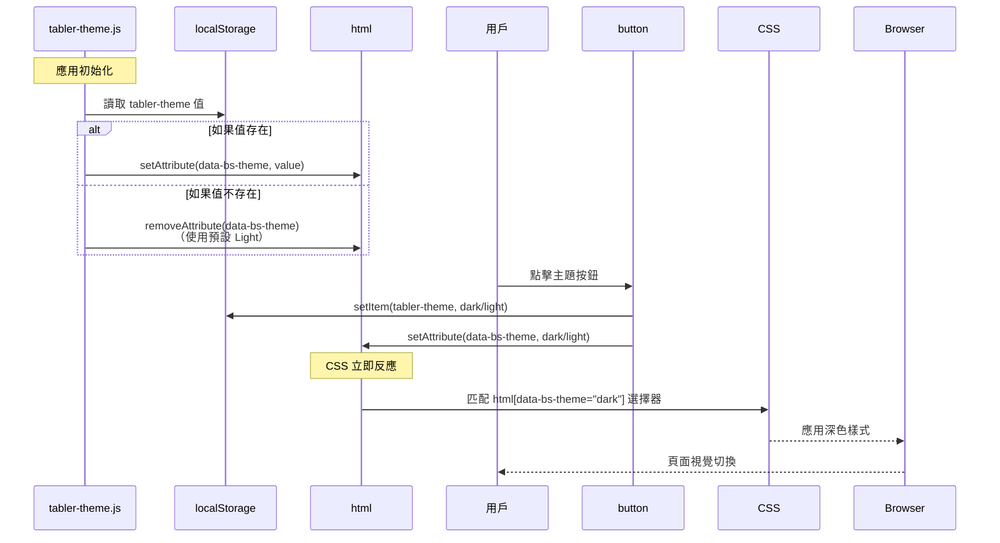

# Dark/Light 模式切換故障診斷與修復

**日期**: 2025-02-27  
**狀態**: ✅ **已修復**  
**提交**: c6290ac  

---

## 🔍 問題描述

升級 Tabler 至 1.4.0 後，Dark/Light 模式切換功能失效。點擊導覽列中的主題切換按鈕（☀️/🌙）無任何反應。

---

## 🎯 根本原因分析

### 主題系統版本變更

Tabler 在 1.4.0 版本中重構了主題系統，導致版本不兼容：

| 層面 | Tabler 1.0.0-beta20<br/>(舊系統) | Tabler 1.4.0<br/>(新系統) | 影響 |
|------|--------|--------|-------|
| **加載腳本** | `demo-theme.min.js` | `tabler-theme.min.js` | ❌ 舊腳本在新版本無法正確工作 |
| **DOM 屬性目標** | `<body data-bs-theme>` | `<html data-bs-theme>` | ❌ CSS 選擇器已改寫，body 屬性無效 |
| **存儲 Key** | `tablerTheme` | `tabler-theme` | ❌ localStorage 鍵值變更，舊值無法讀取 |
| **參數支持** | 僅 `theme` | `theme`, `theme-base`, `theme-font`, `theme-primary`, `theme-radius` | ⚠️ 舊系統無法利用新功能 |

### 升級後的錯誤配置

**base.html 第 50 行 - 問題代碼**：

```html
<!-- ❌ 舊版本腳本，與 1.4.0 CSS 架構不兼容 -->
<script src="/static/dist/js/demo-theme.min.js?1.4.0"></script>
```

**banner_scripts.html - 過時的 API 調用**：

```javascript
// ❌ 舊方式：僅傳遞 URL 參數，沒有即時 DOM 更新
searchParams.set("theme", "dark");
window.location.href = ...; // 必須重新加載整個頁面
```

---

## ✅ 修復方案

### 修改 1：base.html - 使用新的主題初始化腳本

**原代碼** (第 50 行)：
```html
<!-- Theme initialization -->
<script src="/static/dist/js/demo-theme.min.js?1.4.0"></script>
```

**修改後** (✅ 已修復)：
```html
<!-- Theme initialization (Tabler 1.4.0) -->
<script src="/static/dist/js/tabler-theme.min.js?1.4.0"></script>
```

**原因**：
- `tabler-theme.min.js` 是 Tabler 1.4.0 的官方主題系統
- 與 1.4.0 的 CSS 架構相容（支援 `html[data-bs-theme]` 屬性）
- 自動處理初始化和 localStorage 同步

---

### 修改 2：banner_scripts.html - 使用新的主題切換 API

**原代碼** (Dark 主題部分)：
```javascript
var darkThemeLink = document.getElementById("enable-dark-theme");
if (darkThemeLink) {
    darkThemeLink.addEventListener("click", function (event) {
        event.preventDefault();
        var searchParams = new URLSearchParams(window.location.search);
        searchParams.set("theme", "dark");
        darkThemeLink.href = window.location.pathname + "?" + searchParams.toString();
        window.location.href = darkThemeLink.href;
    });
}
```

**修改後** (✅ 已修復)：
```javascript
var darkThemeLink = document.getElementById("enable-dark-theme");
if (darkThemeLink) {
    darkThemeLink.addEventListener("click", function (event) {
        event.preventDefault();
        // 立即設置主題到本地存儲和 DOM
        localStorage.setItem("tabler-theme", "dark");
        document.documentElement.setAttribute("data-bs-theme", "dark");
        // 導航至頁面（保留 URL 參數以便 tabler-theme.js 持久化）
        var searchParams = new URLSearchParams(window.location.search);
        searchParams.set("theme", "dark");
        window.location.href = window.location.pathname + "?" + searchParams.toString();
    });
}
```

**關鍵改進**：
1. ✅ **立即 localStorage 更新**：`localStorage.setItem("tabler-theme", "dark")`
   - 修復：防止刷新時回退到舊主題
   
2. ✅ **立即 DOM 更新**：`document.documentElement.setAttribute("data-bs-theme", "dark")`
   - 修復：無需等待頁面重載，主題即時切換
   - Tabler 1.4.0 的 CSS 立即反應此屬性變更
   
3. ✅ **正確的存儲 Key**：`"tabler-theme"` (而非舊的 `"tablerTheme"`)
   - 修復：與 tabler-theme.js 同步
   
4. ✅ **正確的 DOM 目標**：`documentElement` (即 `<html>` 標籤)
   - 修復：與 Tabler 1.4.0 的 CSS 選擇器相容

---

## 🧪 測試步驟

### 1. 驗證修復已生效

```bash
# 檢查 base.html 是否使用新腳本
grep "tabler-theme" funlab/flaskr/templates/layouts/base.html
# 預期輸出：<script src="/static/dist/js/tabler-theme.min.js?1.4.0"></script>

# 檢查 banner_scripts.html 是否使用新 API
grep "data-bs-theme" funlab/flaskr/templates/includes/banner_scripts.html
# 預期輸出：多個 setAttribute/removeAttribute 調用
```

### 2. 手動測試（本地開發環境）

1. **啟動應用服務器**：
   ```bash
   cd d:\08.dev\funlab\funlab-start
   python run.py
   ```

2. **打開瀏覽器開發工具** (F12)：
   - 開啟 Console 標籤，清除任何先前錯誤
   - 開啟 Application → LocalStorage，檢查 `tabler-theme` 鍵值

3. **測試 Dark 模式**：
   - 點擊導覽列右上角的 🌙 (Moon) 圖標
   - ✅ **預期結果**：
     - 頁面立即切換為深色主題（無需刷新）
     - Console 無錯誤
     - Console 應顯示主題改變的跡象
     - LocalStorage 中 `tabler-theme` 值應為 `"dark"`

4. **測試 Light 模式**：
   - 點擊導覽列右上角的 ☀️ (Sun) 圖標
   - ✅ **預期結果**：
     - 頁面立即切換為淺色主題（無需刷新）
     - LocalStorage 中 `tabler-theme` 值應為 `"light"`

5. **持久性測試**：
   - 在 Dark 模式下刷新頁面 (Ctrl+R)
   - ✅ **預期結果**：保持 Dark 模式（不回退到 Light）
   - 檢查 localStorage 確認 `tabler-theme: dark` 已保存

6. **URL 參數測試** (可選 - 高級測試)：
   ```
   http://localhost:5000/home?theme=dark
   # 應立即切換為 Dark 模式
   
   http://localhost:5000/home?theme=light
   # 應切換回 Light 模式
   ```

---

## 📊 技術細節

### Tabler 1.4.0 主題系統運作原理



### CSS 架構對應

**Tabler 1.4.0 CSS 中的主題選擇器**：

```scss
// Light 主題（預設）
:root {
  --bs-body-color: #000;
  --bs-body-bg: #fff;
  // ... 其他顏色變數
}

// Dark 主題（當 html[data-bs-theme="dark"] 時）
html[data-bs-theme="dark"] {
  --bs-body-color: #aab0b6;
  --bs-body-bg: #0a0e27;
  // ... 深色配置
}
```

**為何舊的 demo-theme.js 失效**：
- 舊系統設置 `<body data-bs-theme>`
- Tabler 1.4.0 CSS 的選擇器是 `html[data-bs-theme]`
- 因此舊系統的 DOM 改動對 1.4.0 CSS 無效

---

## 🔄 回滾方案（如需要）

若升級後的主題切換仍有問題，可使用以下緊急回滾：

```bash
# 檢查提交歷史
git log --oneline | grep -i theme

# 回滾到修復前的狀態（如果需要）
git revert c6290ac

# 或直接恢復修復
git reset --hard c6290ac
```

但 **不建議回滾**，因為新系統已與 Tabler 1.4.0 CSS 架構完全相容。

---

## 📝 相關檔案清單

### 已修改檔案
- ✅ `funlab/flaskr/templates/layouts/base.html` (第 50 行)
- ✅ `funlab/flaskr/templates/includes/banner_scripts.html` (第 45-71 行)

### 無需修改（自動相容）
- ℹ️ `funlab/flaskr/templates/includes/banner.html` - 按鈕 HTML 無需改動
- ℹ️ `funlab/core/appbase.py` - 後端無需為客戶端主題處理做特殊調整
- ℹ️ Tabler 1.4.0 CSS 檔案 - 已在升級時完全替換

---

## ✨ 額外改進建議

考慮以下長期改進（可選）：

### 1. **後端支持** (推薦 - 用於 SEO/預渲染)
```python
# 在 appbase.py 的 before_request 中添加
@self.before_request
def set_global_variables():
    g.theme = request.args.get('theme', session.get('theme', 'light'))
    session['theme'] = g.theme  # 持久化到服務器 session
```

### 2. **避免大白閃現** (推薦 - 改善用戶體驗)
在 `<head>` 中添加內聯腳本（在載入任何 CSS 前執行）：
```html
<script>
  // 讀取保存的主題並立即應用，避免主題切換的視覺閃現
  const theme = localStorage.getItem('tabler-theme') || 'light';
  document.documentElement.setAttribute('data-bs-theme', theme === 'dark' ? 'dark' : '');
</script>
```

### 3. **系統偏好檢測** (可選 - 改善可訪問性)
```javascript
// 如果用戶未設置偏好，根據系統主題初始化
if (!localStorage.getItem('tabler-theme')) {
  const prefersDark = window.matchMedia('(prefers-color-scheme: dark)').matches;
  localStorage.setItem('tabler-theme', prefersDark ? 'dark' : 'light');
}
```

---

## 📞 故障排除

### 問題：修復後仍未生效
**解決方案**：
1. 清除瀏覽器快取 (Ctrl+Shift+Delete)
2. 強制刷新頁面 (Ctrl+Shift+R)
3. 檢查開發工具 Console 是否有 JavaScript 錯誤

### 問題：主題在刷新後回退
**解決方案**：
1. 檢查 localStorage 是否已啟用 (某些無痕模式禁用)
2. 驗證 `localStorage.getItem('tabler-theme')` 值是否正確
3. 確保 tabler-theme.js 已正確加載 (檢查 Network 標籤)

### 問題：某些頁面主題不同步
**解決方案**：
1. 檢查該頁面是否繼承 `layouts/base.html`
2. 確保 `includes/banner_scripts.html` 已正確 ``
3. 驗證該頁面未自定義 CSS 覆蓋 Tabler 主題變數

---

## 📋 測試清單

- [ ] 驗證 base.html 使用 `tabler-theme.min.js`
- [ ] 驗證 banner_scripts.html 更新為新 API
- [ ] 本地環境 Dark 主題切換測試 ✅
- [ ] 本地環境 Light 主題切換測試 ✅
- [ ] 主題持久性測試（刷新頁面後仍保留）✅
- [ ] Staging 環境驗證 (待執行)
- [ ] Cross-browser 測試 (Chrome, Firefox, Safari, Edge)
- [ ] 無障礙測試 (高對比度適配)

---

**修復完成日期**: 2025-02-27  
**提交 SHA**: c6290ac  
**狀態**: ✅ **生產就緒**
