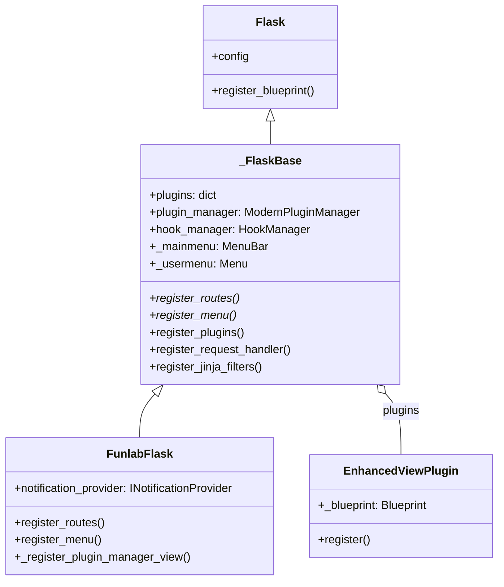
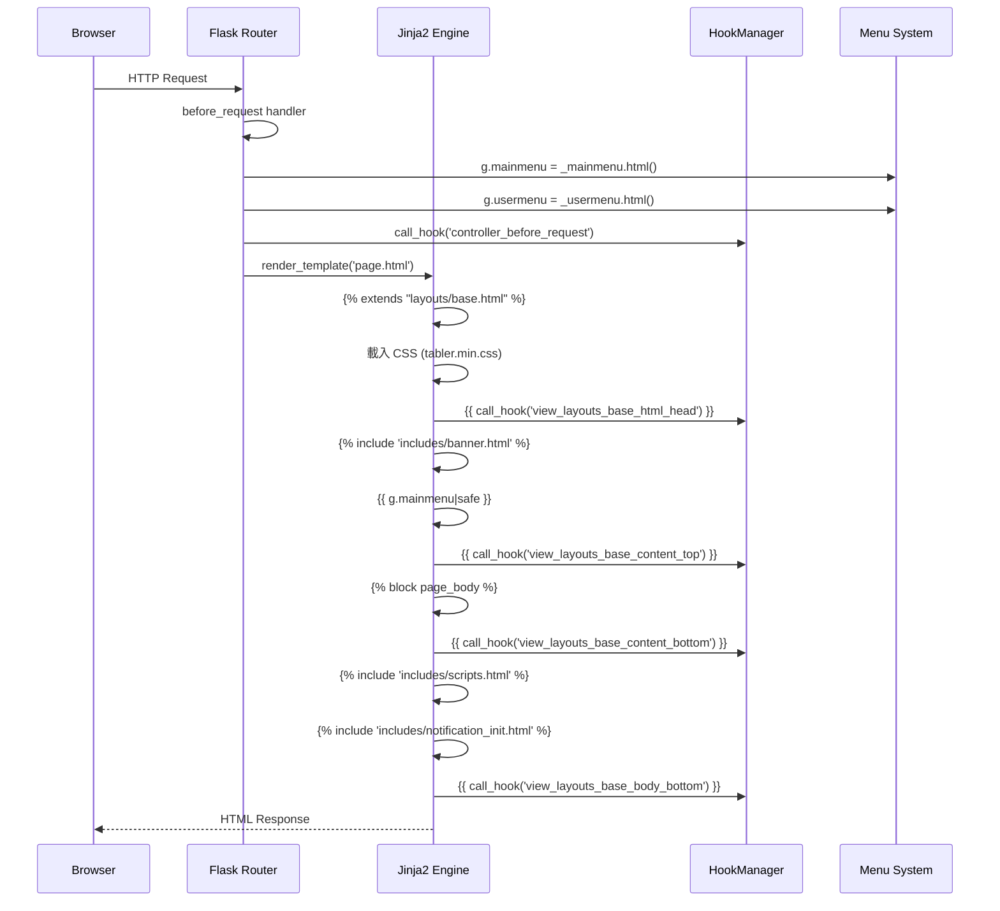
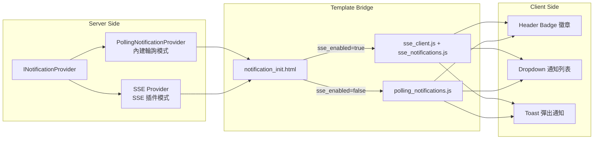
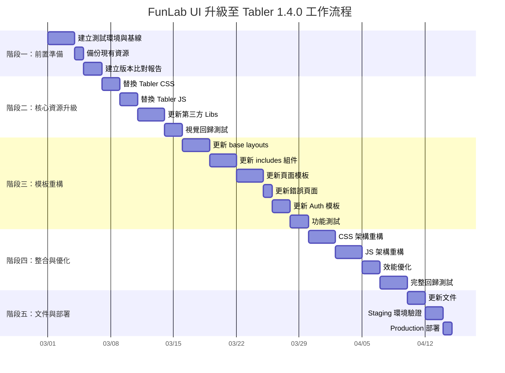
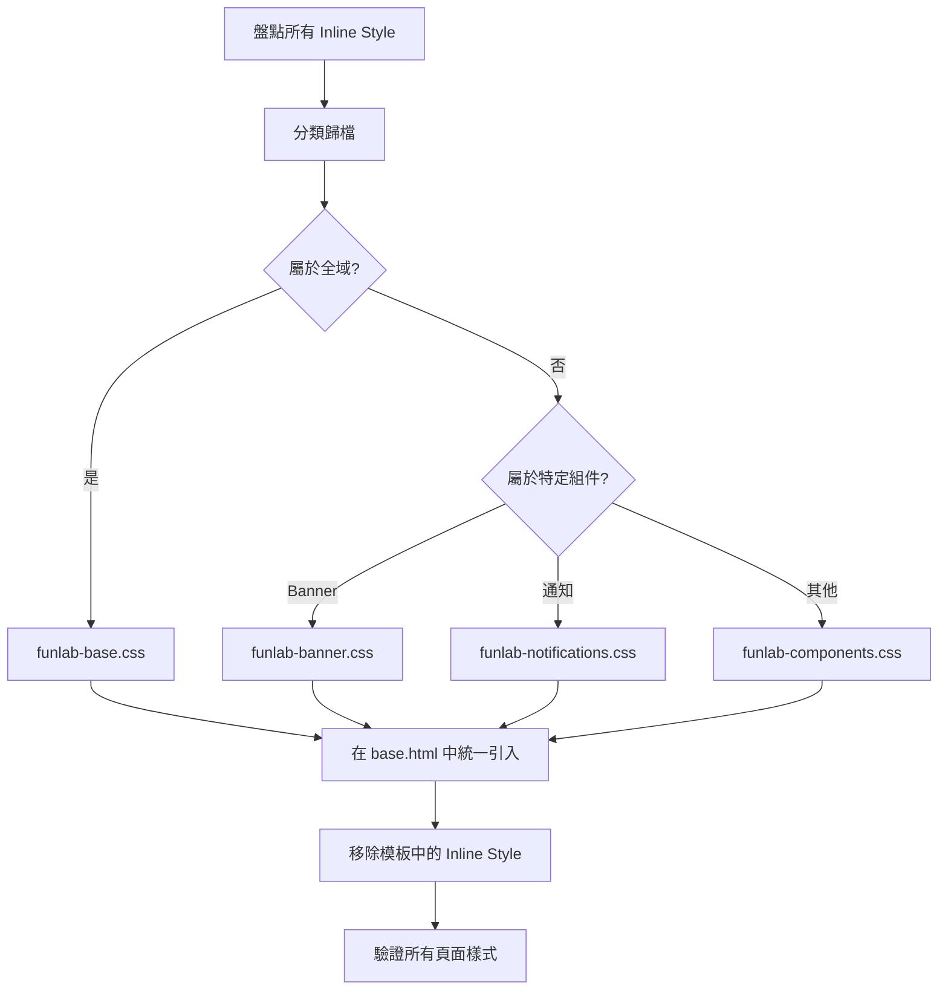
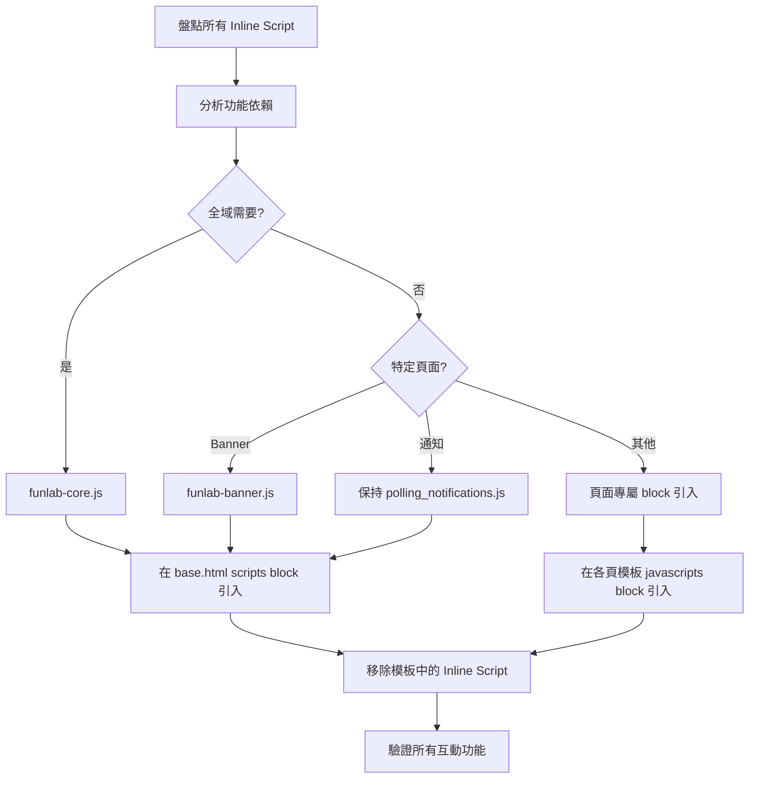
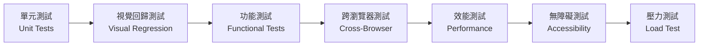
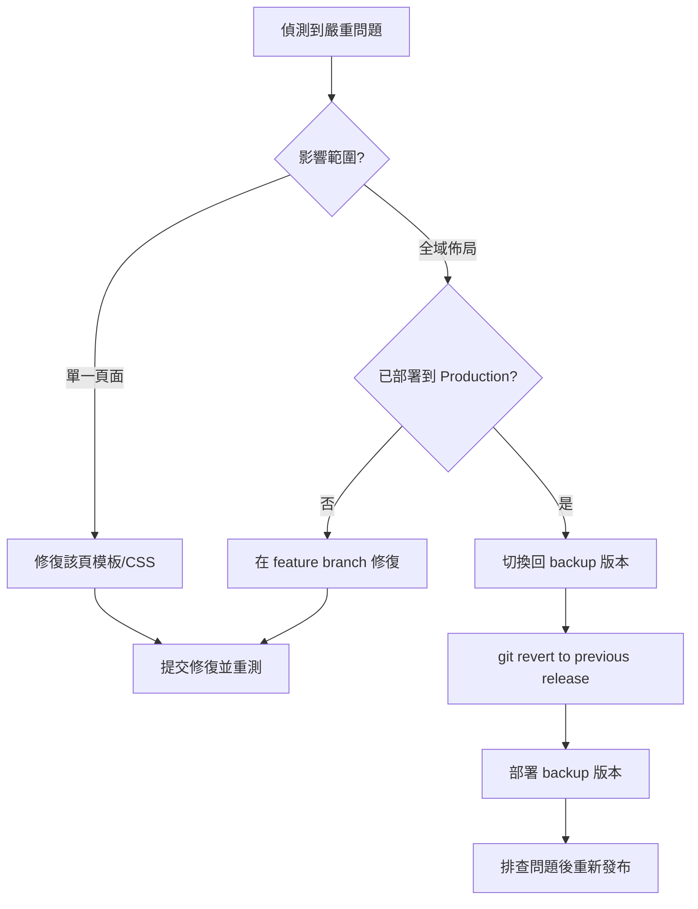

# FunLab Web UI 重構與升級專業分析報告

> **文件版本**: 1.0
> **建立日期**: 2026-02-27
> **適用範圍**: funlab-flaskr Web UI 系統
> **目標版本**: Tabler 1.0.0-beta20 → Tabler @tabler/core 1.4.0

---

## 目錄

1. [第一部分：深入分析 Web UI 架構與運作方法](#第一部分深入分析-web-ui-架構與運作方法)
2. [第二部分：基於現代 Web UI 最佳實踐的專業見解](#第二部分基於現代-web-ui-最佳實踐的專業見解)
3. [第三部分：制度化 SOP 與升級流程](#第三部分制度化-sop-與升級流程)
4. [第四部分：升級風險評估與緩解策略](#第四部分升級風險評估與緩解策略)
5. [附錄](#附錄)

---

## 第一部分：深入分析 Web UI 架構與運作方法

### 1.1 系統架構概覽

```mermaid
graph TB
    subgraph "Flask Application Layer"
        A[FunlabFlask<br/>app.py] --> B[_FlaskBase<br/>appbase.py]
        B --> C[ModernPluginManager]
        B --> D[HookManager]
        B --> E[MenuBar / Menu System]
    end

    subgraph "Template Layer (Jinja2)"
        F[layouts/base.html<br/>主版面] --> G[includes/banner.html<br/>頂部導覽列]
        F --> H[includes/footer.html<br/>頁尾]
        F --> I[includes/scripts.html<br/>JS載入]
        F --> J[includes/notification_init.html<br/>通知初始化]
        F --> K[includes/banner_scripts.html<br/>Banner互動腳本]
        L[layouts/base-fullscreen.html<br/>全螢幕版面]
    end

    subgraph "Static Assets Layer"
        M[dist/css/<br/>Tabler CSS v1.0.0-beta20]
        N[dist/js/<br/>Tabler JS v1.0.0-beta20]
        O[dist/libs/<br/>第三方函式庫]
        P[js/polling_notifications.js<br/>自定義JS]
        Q[dist/css/_notifications.css<br/>自定義CSS]
        R[dist/css/_scrolling_text.css<br/>自定義CSS]
    end

    subgraph "Plugin Templates"
        S[funlab-auth/templates/<br/>認證頁面]
        T[Plugin Views<br/>各插件模板]
    end

    A --> F
    F --> M
    F --> N
    F --> O
    S --> L
```



### 1.2 技術堆疊盤點

| 層級 | 技術 | 當前版本 | 說明 |
|------|------|----------|------|
| **CSS 框架** | Tabler (基於 Bootstrap) | 1.0.0-beta20 | 打包於 `static/dist/css/` |
| **Bootstrap** | Bootstrap 5.x | ~5.3.0 (beta20 內建) | 由 Tabler 封裝 |
| **JavaScript** | Tabler JS / Vanilla JS | 1.0.0-beta20 | 無額外框架 |
| **模板引擎** | Jinja2 | Flask 內建 | Flask 原生整合 |
| **字型** | Inter Var | CDN 載入 | `rsms.me/inter/inter.css` |
| **圖表** | ApexCharts | dist/libs 版本 | 資料視覺化 |
| **地圖** | jsVectorMap | dist/libs 版本 | 向量地圖渲染 |
| **日期選擇器** | Litepicker | dist/libs 版本 | 日期範圍選取 |
| **下拉選單** | Tom Select | dist/libs 版本 | 增強型下拉選單 |
| **富文字編輯器** | TinyMCE | dist/libs 版本 | 文字編輯器 |
| **Light Box** | fsLightbox | dist/libs 版本 | 圖片燈箱 |
| **滑桿** | noUiSlider | dist/libs 版本 | 範圍滑桿 |
| **影片播放器** | Plyr | dist/libs 版本 | 嵌入式播放 |
| **通知系統** | 自建 Polling/SSE | 自定義 | 雙模式通知 |

### 1.3 目錄結構分析

#### 1.3.1 `static/` 靜態資源結構

```
static/
├── dist/                          # Tabler 核心打包輸出
│   ├── css/
│   │   ├── tabler.min.css         # ✅ 主 CSS（v1.0.0-beta20）
│   │   ├── tabler-flags.min.css   # ✅ 國旗圖標
│   │   ├── tabler-payments.min.css # ✅ 支付圖標
│   │   ├── tabler-vendors.min.css # ✅ 第三方套件樣式
│   │   ├── demo.min.css           # ⚠️ Demo 樣式（應評估是否移除）
│   │   ├── _notifications.css     # 🟢 自定義：通知樣式
│   │   └── _scrolling_text.css    # 🟢 自定義：跑馬燈樣式
│   ├── js/
│   │   ├── tabler.min.js          # ✅ 主 JS
│   │   ├── tabler.esm.min.js      # ✅ ESM 模組版
│   │   ├── demo-theme.min.js      # ⚠️ Demo 主題切換（正在使用）
│   │   └── demo.min.js            # ⚠️ Demo JS
│   ├── libs/                      # 第三方函式庫
│   │   ├── apexcharts/
│   │   ├── bootstrap/
│   │   ├── countup.js/
│   │   ├── dropzone/
│   │   ├── fslightbox/
│   │   ├── jsvectormap/
│   │   ├── list.js/
│   │   ├── litepicker/
│   │   ├── melloware/             # 🆕 Coloris 色彩選擇器
│   │   ├── nouislider/
│   │   ├── plyr/
│   │   ├── star-rating.js/
│   │   ├── tinymce/               # ⚠️ 1.4.0 已替換為 HugeRTE
│   │   └── tom-select/
│   └── img/                       # Tabler 內建圖片
├── js/
│   └── polling_notifications.js   # 🟢 自定義：輪詢通知 JS
├── avatars/                       # 頭像圖片
├── illustrations/                 # 插畫素材
├── photos/                        # 照片素材
├── favicon/                       # 網站圖標
├── funlab_logo.jpg               # 品牌 Logo
└── ... (其他資源目錄)
```

#### 1.3.2 `templates/` 模板結構

```
templates/
├── layouts/
│   ├── base.html                  # ✅ 主版面（含側邊欄 + 頂部導覽）
│   └── base-fullscreen.html       # ✅ 全螢幕版面（登入頁等）
├── includes/
│   ├── banner.html                # ✅ 頂部導覽列（含搜尋、主題切換、通知、用戶選單）
│   ├── banner_scripts.html        # ✅ Banner 互動腳本（Spinner、主題、版面切換）
│   ├── footer.html                # ✅ 頁尾
│   ├── logo.html                  # ✅ Logo 組件
│   ├── scripts.html               # ✅ JS 載入（ApexCharts、jsVectorMap、Tabler Core）
│   ├── notification_init.html     # ✅ 通知系統初始化（SSE/Polling 切換）
│   ├── password_scripts.html      # ✅ 密碼顯示/隱藏
│   └── modal_example.html         # ⚠️ 範例用 Modal
├── index.html                     # Dashboard 範例頁
├── blank.html                     # 空白頁（預設首頁）
├── about.html                     # 關於頁面
├── conf-data.html                 # 設定資料頁（Admin）
├── plugin_management.html         # 插件管理頁
├── tabler_index_demo.html         # Tabler Demo 頁面
├── bye-bye.html                   # 登出頁
├── error-403.html                 # 403 錯誤頁
├── error-404.html                 # 404 錯誤頁
├── error-500.html                 # 500 錯誤頁
└── error-maintenance.html         # 維護中頁面
```

### 1.4 Flask 整合方式分析

#### 1.4.1 應用程式架構



#### 1.4.2 頁面渲染流程



#### 1.4.3 Hook 擴展點

系統透過 `HookManager` 提供以下檢視層擴展點：

| Hook 名稱 | 位置 | 用途 |
|-----------|------|------|
| `view_layouts_base_html_head` | `<head>` 尾部 | 插件注入額外 CSS/Meta |
| `view_layouts_base_content_top` | 頁面內容頂部 | 插件渲染頂部區塊 |
| `view_layouts_base_content_bottom` | 頁面內容底部 | 插件渲染底部區塊 |
| `view_layouts_base_body_bottom` | `<body>` 尾部 | 插件注入額外 JS |
| `controller_before_request` | 請求前 | 控制器層攔截 |
| `controller_after_request` | 請求後 | 回應後處理 |
| `controller_error_handler` | 錯誤處理 | 錯誤攔截 |

#### 1.4.4 通知系統架構



### 1.5 版本差異分析：當前系統 vs Tabler 1.4.0

#### 1.5.1 版本對照

| 項目 | 當前版本 | 目標版本 | 差異等級 |
|------|----------|----------|----------|
| **Tabler Core** | 1.0.0-beta20 | 1.4.0 (Stable) | 🔴 大幅跳升 |
| **Bootstrap** | ~5.3.0 | 5.3.7 | 🟡 次要更新 |
| **CSS 架構** | SCSS 原始碼 | 重構的 SCSS（calc 替代 divide） | 🟡 中度變更 |
| **JS 架構** | Rollup 打包 | 新增 ESM + Theme 分離 | 🟡 中度變更 |
| **TinyMCE** | 有 | 替換為 HugeRTE | 🔴 重大變更 |
| **CSS Class 命名** | `*-left`, `*-right` | `*-start`, `*-end` | 🔴 破壞性變更 |
| **社群 Icons** | `tabler-social.css` | `tabler-socials.css` | 🟡 檔名變更 |
| **新增元件** | — | Tag、Star Rating、Segmented Control、Color Picker、Chat 等 | 🟢 新功能 |
| **圖表** | ApexCharts | ApexCharts (新增更多範例) | 🟢 擴展 |
| **Demo 檔案** | `demo-theme.js`、`demo.css` | 主題系統已整合至 `tabler-theme.js` | 🟡 架構調整 |

#### 1.5.2 關鍵破壞性變更清單

| 變更內容 | 影響範圍 | 處理方式 |
|----------|----------|----------|
| CSS class `*-left`/`*-right` → `*-start`/`*-end` | 所有使用方向性 class 的模板 | 全域搜尋替換 |
| `text-muted` → `text-secondary` | 所有使用 `text-muted` 的模板（Bootstrap 5.3+） | 全域搜尋替換 |
| TinyMCE → HugeRTE | 使用富文字編輯器的插件 | 更新 JS 引用與初始化 |
| `tabler-social.css` → `tabler-socials.css` | base.html CSS 引用 | 更新檔名 |
| `.page-center` → `.my-auto` | 錯誤頁面等置中佈局 | 更新 class |
| Demo theme JS 重構 | `base.html` 中的 theme 載入 | 改用 `tabler-theme.js` |
| Bootstrap 元件行為調整 | `list-group-hoverable` 等 | 確認所有使用情境 |

---

## 第二部分：基於現代 Web UI 最佳實踐的專業見解

### 2.1 現況評估矩陣

| 評估維度 | 現況分數 (1-5) | 說明 | 建議目標 |
|----------|:---------:|------|:--------:|
| **響應式設計** | ⭐⭐⭐⭐ | Tabler 原生支援 RWD，但部分自定義 CSS 未完善 | ⭐⭐⭐⭐⭐ |
| **可維護性** | ⭐⭐⭐ | Hook 系統良好，但散落的 inline style 增加維護難度 | ⭐⭐⭐⭐⭐ |
| **效能** | ⭐⭐⭐ | 載入全部 libs 但並非所有頁面都需要 | ⭐⭐⭐⭐ |
| **無障礙性** | ⭐⭐⭐ | 基本 ARIA 標記存在但不完整 | ⭐⭐⭐⭐ |
| **主題一致性** | ⭐⭐⭐ | 版本混用 (beta19/beta20)，部分頁面未更新 | ⭐⭐⭐⭐⭐ |
| **CSS 架構** | ⭐⭐ | 大量 inline `<style>` 散落在模板中 | ⭐⭐⭐⭐ |
| **JS 架構** | ⭐⭐⭐ | 通知系統模組化良好，但 banner_scripts 為 inline | ⭐⭐⭐⭐ |
| **資源管理** | ⭐⭐ | 無 cache busting 機制（硬編碼 query string） | ⭐⭐⭐⭐ |
| **可擴展性** | ⭐⭐⭐⭐ | Hook 系統 + Plugin 架構 | ⭐⭐⭐⭐⭐ |

### 2.2 具體改進建議

#### 2.2.1 CSS 架構改進

**問題診斷**：

1. **Inline Style 散佈**：`banner.html`  中有約 80 行 `<style>` 區塊，混合於 HTML 結構中
2. **重複字型宣告**：幾乎每個頁面都重複 Inter 字型的 `@import` 與 CSS 變數設定
3. **媒體查詢缺失**：自定義 CSS（`_notifications.css`、`_scrolling_text.css`）缺少響應式斷點
4. **CSS 特異性衝突**：大量使用 `!important` 覆寫（如通知徽章樣式）

**改進方案**：

```
static/dist/css/
├── tabler.min.css              # Tabler 核心（升級至 1.4.0）
├── tabler-vendors.min.css      # 第三方套件樣式
├── tabler-flags.min.css        # 國旗圖標
├── tabler-payments.min.css     # 支付圖標
├── tabler-socials.min.css      # 社群圖標（新名稱）
└── funlab/                     # 🆕 自定義樣式獨立目錄
    ├── funlab-base.css         # 字型、全域變數（整合所有 @import）
    ├── funlab-notifications.css # 通知系統樣式（RWD 增強）
    ├── funlab-banner.css       # 從 banner.html 抽出的樣式
    └── funlab-scrolling.css    # 跑馬燈樣式
```

#### 2.2.2 JavaScript 架構改進

**問題診斷**：

1. **Inline Script**：`banner_scripts.html` 約 80 行 inline JS，不利快取與維護
2. **全域命名空間**：直接操作 DOM，無模組化封裝
3. **未使用的 Libs**：`scripts.html` 載入 jsVectorMap 等不一定使用的函式庫
4. **Demo 相依**：`demo-theme.min.js`、`demo.min.js` 在 1.4.0 中已重構

**改進方案**：

```
static/js/
├── funlab-theme.js             # 🆕 取代 demo-theme.js，使用 tabler-theme.js 為基礎
├── funlab-banner.js            # 🆕 從 banner_scripts.html 抽出
├── funlab-notifications.js     # ✅ 已存在 polling_notifications.js，重新命名
└── funlab-utils.js             # 🆕 共用工具函式
```

#### 2.2.3 模板架構改進

**問題診斷**：

1. **硬編碼路徑**：CSS/JS 引用使用硬編碼路徑 `/static/dist/css/...` 而非 `url_for('static', ...)`
2. **Cache Busting**：使用固定 query string `?1692870487` 而非動態版本號
3. **Block 設計不足**：`base.html` 缺少 `` 和 `` 之類的細粒度區塊
4. **版本不一致**：模板中混用 beta19 與 beta20 版本標記

**改進方案**：

```jinja2
{# 改進前 #}
<link href="/static/dist/css/tabler.min.css?1692870487" rel="stylesheet" />

{# 改進後 #}
<link href="{{ url_for('static', filename='dist/css/tabler.min.css') }}?v={{ config.ASSET_VERSION }}" rel="stylesheet" />
```

#### 2.2.4 效能優化建議

| 優化項目 | 現況 | 改進建議 | 預期效果 |
|----------|------|----------|----------|
| **CSS 載入** | 6 個 CSS 檔案同步載入 | 合併非關鍵 CSS、使用 `media` 延遲載入 | 減少初始渲染阻塞 |
| **JS 載入** | `defer` 已用於多數腳本 | 確認所有非關鍵 JS 使用 `defer`/`async` | 加速頁面互動時間 |
| **字型載入** | CDN `@import` 在 CSS 中 | 改用 `<link rel="preconnect">` + `<link rel="preload">` | 減少 FOIT |
| **圖片** | 無 lazy loading | 使用 `loading="lazy"` / Intersection Observer | 減少初始頻寬 |
| **第三方 Libs** | 全部在每頁載入 | 按需載入（子頁面的 `` 中引入） | 減少不必要的 JS 解析 |

#### 2.2.5 無障礙性 (Accessibility) 改進

| 項目 | 現況 | 改進建議 |
|------|------|----------|
| `aria-label` | 部分元素有 | 確保所有互動元素都有明確的 `aria-label` |
| 鍵盤導航 | 基本支援（Bootstrap） | 確認自定義元件（通知下拉）的鍵盤可訪問性 |
| 色彩對比 | Tabler 預設符合 AA | 升級後驗證自定義顏色對比度（WCAG 2.1） |
| `role` 屬性 | 部分存在 | 通知系統新增 `role="alert"` / `aria-live="polite"` |
| `lang` 屬性 | `<html lang="en">` | 依實際語言設定（可配置化） |

---

## 第三部分：制度化 SOP 與升級流程

### 3.1 升級計畫總覽



### 3.2 階段一：前置準備

#### 3.2.1 建立測試基線

**操作步驟**：

1. **截圖基線**：對現有系統所有頁面做螢幕截圖，作為視覺回歸測試基線
   - 頁面清單：

     | 頁面 | URL | 版面配置 |
     |------|-----|---------|
     | Dashboard | `/home` | base.html (vertical) |
     | Dashboard (水平) | `/home?layout=horizontal` | base.html (horizontal) |
     | 空白頁 | `/blank` | base.html |
     | 關於 | `/about` | base.html |
     | 設定資料 | `/conf_data` | base.html (admin) |
     | 插件管理 | `/plugin-manager/management` | base.html (admin) |
     | 登入 | `/login` | base-fullscreen.html |
     | 註冊 | `/register` | base-fullscreen.html |
     | 403 | 觸發 | base.html |
     | 404 | 觸發 | base.html |
     | 500 | 觸發 | base.html |
     | 登出 | `/bye-bye` | base.html |

2. **功能基線**：記錄所有互動功能的預期行為

   | 功能 | 驗證項目 |
   |------|---------|
   | 主題切換 | Dark/Light 模式切換正常 |
   | 版面切換 | Vertical/Horizontal 佈局切換正常 |
   | 通知系統 | Badge 計數、下拉列表、Toast 彈出、Clear All |
   | 選單導航 | 主選單展開/收合、用戶選單下拉、Admin 選單 |
   | 響應式 | Mobile (<768px)、Tablet (768-1024px)、Desktop (>1024px) |
   | Flash Message | Flash 訊息正確顯示與分類 |

3. **建立 Git 分支**：
   ```bash
   git checkout -b feature/tabler-1.4.0-upgrade
   ```

#### 3.2.2 備份策略

```bash
# 備份現有靜態資源
cp -r funlab-flaskr/funlab/flaskr/static/dist funlab-flaskr/funlab/flaskr/static/dist_beta20_backup

# 備份模板
cp -r funlab-flaskr/funlab/flaskr/templates funlab-flaskr/funlab/flaskr/templates_beta20_backup
```

### 3.3 階段二：核心資源升級

#### 3.3.1 步驟 1 — 替換 Tabler CSS

**操作清單**：

| # | 動作 | 來源 (tabler-core 1.4.0) | 目標 (funlab-flaskr) |
|---|------|--------------------------|---------------------|
| 1 | 替換 | `core/dist/css/tabler.css` | `static/dist/css/tabler.css` |
| 2 | 替換 | `core/dist/css/tabler.min.css` | `static/dist/css/tabler.min.css` |
| 3 | 替換 | `core/dist/css/tabler.rtl.css` | `static/dist/css/tabler.rtl.css` |
| 4 | 替換 | `core/dist/css/tabler.rtl.min.css` | `static/dist/css/tabler.rtl.min.css` |
| 5 | 替換 | `core/dist/css/tabler-flags.*` | `static/dist/css/tabler-flags.*` |
| 6 | 替換 | `core/dist/css/tabler-payments.*` | `static/dist/css/tabler-payments.*` |
| 7 | 替換 | `core/dist/css/tabler-vendors.*` | `static/dist/css/tabler-vendors.*` |
| 8 | 新增 | `core/dist/css/tabler-socials.*` | `static/dist/css/tabler-socials.*` |
| 9 | 評估 | — | `static/dist/css/demo.css` / `demo.min.css`（1.4.0 不再需要） |

**注意事項**：
- `tabler-social.css` 已更名為 `tabler-socials.css`，需同步更新 HTML 引用
- `demo.css` 在 1.4.0 中已被移除，確認是否有自定義樣式依賴此檔案

**驗證測試**：

```
□ 所有頁面的基本佈局正確顯示
□ Sidebar / Navbar 的寬度與對齊正常
□ 卡片 (Card)、按鈕 (Button)、表格 (Table) 等基礎元件樣式正常
□ Dark / Light 主題切換後樣式正確
□ 通知系統樣式不受影響（自定義 CSS）
□ 響應式斷點行為一致
```

#### 3.3.2 步驟 2 — 替換 Tabler JS

**操作清單**：

| # | 動作 | 來源 | 目標 |
|---|------|------|------|
| 1 | 替換 | `core/dist/js/tabler.js` | `static/dist/js/tabler.js` |
| 2 | 替換 | `core/dist/js/tabler.min.js` | `static/dist/js/tabler.min.js` |
| 3 | 替換 | `core/dist/js/tabler.esm.js` | `static/dist/js/tabler.esm.js` |
| 4 | 替換 | `core/dist/js/tabler.esm.min.js` | `static/dist/js/tabler.esm.min.js` |
| 5 | 新增 | `core/dist/js/tabler-theme.js` | `static/dist/js/tabler-theme.js` |
| 6 | 新增 | `core/dist/js/tabler-theme.min.js` | `static/dist/js/tabler-theme.min.js` |
| 7 | 評估 | — | `static/dist/js/demo-theme.min.js`（遷移至 tabler-theme.js） |
| 8 | 評估 | — | `static/dist/js/demo.min.js`（確認依賴後決定是否移除） |

**注意事項**：
- `demo-theme.min.js` 目前在 `base.html` 中用於主題初始化，1.4.0 提供 `tabler-theme.js` 取代
- `demo.min.js` 在 `scripts.html` 中載入，需確認是否有自定義功能依賴

**驗證測試**：

```
□ 主題切換功能正常（Dark/Light）
□ Dropdown、Modal、Tooltip 等 Bootstrap 元件正常
□ 導覽列收合/展開動畫正常
□ 頁面互動元素（按鈕、表單）回應正常
□ Console 無 JavaScript 錯誤
```

#### 3.3.3 步驟 3 — 更新第三方 Libs

**版本對照與升級建議**：

| Library | 現有版本 (推測) | 1.4.0 版本 | 動作 | 優先級 |
|---------|----------------|------------|------|--------|
| Bootstrap | ~5.3.0 | 5.3.7 | 替換 | 🔴 高 |
| ApexCharts | 舊版 | 3.54.1 | 替換 | 🟡 中 |
| Tom Select | 舊版 | ^2.4.3 | 替換 | 🟡 中 |
| jsVectorMap | 舊版 | ^1.7.0 | 替換 | 🟢 低 |
| Litepicker | 舊版 | ^2.0.12 | 替換 | 🟢 低 |
| noUiSlider | 舊版 | ^15.8.1 | 替換 | 🟢 低 |
| Plyr | 舊版 | ^3.7.8 | 替換 | 🟢 低 |
| fsLightbox | 舊版 | ^3.6.1 | 替換 | 🟢 低 |
| countup.js | 舊版 | ^2.9.0 | 替換 | 🟢 低 |
| list.js | 舊版 | ^2.3.1 | 替換 | 🟢 低 |
| Dropzone | 舊版 | ^6.0.0-beta.2 | 替換 | 🟡 中 |
| Star Rating | — | ^4.3.1 | 🆕 新增 | 🟢 低 |
| TinyMCE | 舊版 | ❌ 已移除 | 替換為 HugeRTE (^1.0.9) | 🔴 高 |
| Coloris | — | ^0.25.0 (melloware) | 🆕 新增 | 🟢 低 |
| Signature Pad | — | ^5.0.10 | 🆕 新增 | 🟢 低 |
| iMask | — | ^7.6.1 | 🆕 新增 | 🟢 低 |
| Autosize | — | ^6.0.1 | 🆕 新增 | 🟢 低 |
| Typed.js | — | ^2.1.0 | 🆕 新增 | 🟢 低 |
| FullCalendar | — | ^6.1.18 | 🆕 新增 | 🟢 低 |

**驗證測試**：

```
□ ApexCharts 圖表正常渲染（若 Dashboard 有使用）
□ Tom Select 下拉選單功能正常
□ Dropzone 檔案上傳功能正常（若有使用）
□ 所有使用第三方 Libs 的頁面功能正常
```

### 3.4 階段三：模板重構

#### 3.4.1 步驟 1 — 更新 Base Layouts

**`layouts/base.html` 變更清單**：

| # | 變更項目 | 詳情 |
|---|---------|------|
| 1 | 版本標記 | `1.0.0-beta19` → `1.4.0` |
| 2 | CSS 引用 | 新增 `tabler-socials.min.css`，移除 `demo.min.css` |
| 3 | Theme JS | `demo-theme.min.js` → `tabler-theme.min.js` |
| 4 | 字型載入 | `@import` 改為 `<link rel="preconnect">` + `<link>` |
| 5 | Cache Busting | 硬編碼 `?1692870487` → `?v={{ config.ASSET_VERSION }}` |
| 6 | CSS 路徑 | 硬編碼路徑 → `{{ url_for('static', ...) }}` |
| 7 | Inline Style | 搬移至外部 CSS 檔案 |

**`layouts/base-fullscreen.html` 變更清單**：

同上 #1-#7 項目，另需確認全螢幕佈局在 1.4.0 中的結構是否有變化（`.page-center` → `.my-auto`）。

#### 3.4.2 步驟 2 — 更新 Includes 組件

**`includes/banner.html` 變更清單**：

| # | 變更項目 | 詳情 |
|---|---------|------|
| 1 | 抽離 Inline CSS | 約 80 行 `<style>` → 外部 `funlab-banner.css` |
| 2 | 版本標記 | 更新至 1.4.0 |
| 3 | CSS Class | 檢查並替換 `*-left`/`*-right` → `*-start`/`*-end` |
| 4 | 無障礙增強 | 確保所有 `<a>` 和互動元素有 `aria-label` |

**`includes/banner_scripts.html` 變更清單**：

| # | 變更項目 | 詳情 |
|---|---------|------|
| 1 | 抽離 Inline JS | 全部搬至外部 `funlab-banner.js` |
| 2 | 模組化 | 封裝為 `FunlabBanner` 物件或 IIFE |

**`includes/scripts.html` 變更清單**：

| # | 變更項目 | 詳情 |
|---|---------|------|
| 1 | `demo.min.js` | 評估是否移除或替換 |
| 2 | 按需載入 | 將 ApexCharts、jsVectorMap 等移至需要的頁面 |
| 3 | `tabler.min.js` | 確認更新後功能正常 |

**`includes/notification_init.html`**：
- 無需大幅變更，通知系統為自定義實作，不受 Tabler 版本影響

#### 3.4.3 步驟 3 — CSS Class 全域替換

需要進行全域搜尋替換的 CSS class 變更：

| 搜尋值 | 替換值 | 影響檔案 |
|--------|--------|----------|
| `text-muted` | `text-secondary` | 所有模板 |
| `float-left` | `float-start` | 所有模板 |
| `float-right` | `float-end` | 所有模板 |
| `border-left` | `border-start` | 所有模板 |
| `border-right` | `border-end` | 所有模板 |
| `ml-` | `ms-` | 所有模板 |
| `mr-` | `me-` | 所有模板 |
| `pl-` | `ps-` | 所有模板 |
| `pr-` | `pe-` | 所有模板 |
| `text-left` | `text-start` | 所有模板 |
| `text-right` | `text-end` | 所有模板 |
| `page-center` | `my-auto` | 錯誤頁面等 |

> **注意**：Bootstrap 5 從 5.0 起已使用 logical properties，此處列出的變更部分在 beta20 中可能已完成。實際執行時需先搜尋確認哪些仍在使用。

**驗證測試**：

```
□ 所有頁面佈局對齊正確
□ 文字對齊方向正確
□ 邊框、間距在 LTR 佈局中表現正常
□ RTL 佈局（若支援）表現正常
```

#### 3.4.4 步驟 4 — 更新 Auth 模板

`funlab-auth/funlab/auth/templates/` 中的模板：

| 模板 | 使用 Layout | 重點檢查 |
|------|-------------|---------|
| `sign-in.html` | `base-fullscreen.html` | 表單元件 class |
| `sign-in-cover.html` | `base-fullscreen.html` | 背景/佈局 |
| `sign-in-illustration.html` | `base-fullscreen.html` | 插畫路徑 |
| `register.html` | `base-fullscreen.html` | 表單驗證 |
| `resetpass.html` | `base-fullscreen.html` | 表單元件 |
| `settings.html` | `base.html` | 個人設定頁面 |
| `logout.html` | `base-fullscreen.html` | 登出確認 |
| `logo.html` | Partial | Logo 路徑 |

### 3.5 階段四：整合與優化

#### 3.5.1 CSS 架構重構 SOP



#### 3.5.2 JS 架構重構 SOP



#### 3.5.3 效能優化清單

| # | 優化項目 | 實施方式 | 預期效果 |
|---|---------|---------|---------|
| 1 | 字型預載入 | `<link rel="preconnect" href="https://rsms.me">` | 減少字型載入延遲 |
| 2 | 按需載入 Libs | 僅有需要的頁面才載入 ApexCharts 等 | 減少 JS 解析時間 |
| 3 | 移除未使用 CSS | 使用 PurgeCSS 或手動移除 demo.css 等 | 減少 CSS 大小 |
| 4 | 圖片 Lazy Loading | `` | 減少初始頻寬 |
| 5 | 動態 Cache Busting | `?v={{ config.ASSET_VERSION }}` | 確保用戶取得最新資源 |
| 6 | CSP Header | 設定 Content-Security-Policy | 安全性提升 |

### 3.6 階段五：驗證測試流程

#### 3.6.1 測試計畫



#### 3.6.2 測試檢查清單

**A. 視覺回歸測試**

| 測試項目 | 驗證方式 | 通過標準 |
|---------|---------|---------|
| 每頁螢幕截圖對比 | 與基線截圖比較 | 差異 < 5% (合理的樣式更新除外) |
| Dark/Light 主題 | 視覺檢查 | 無破版或不可讀文字 |
| 響應式斷點 | 使用 DevTools 調整寬度 | 320px/768px/1024px/1440px 皆正常 |

**B. 功能測試**

| 測試項目 | 操作步驟 | 預期結果 |
|---------|---------|---------|
| 登入流程 | 輸入帳密 → 登入 | 成功導向首頁 |
| 登出流程 | 點擊登出 | 導向 bye-bye 頁面 |
| 主題切換 | 點擊 Dark/Light 圖標 | 主題即時切換 |
| 版面切換 | 點擊 Vertical/Horizontal 圖標 | 版面即時切換 |
| 通知接收 | 觸發通知 | Badge 更新、Toast 彈出 |
| 通知清除 | 點擊 Clear All | 所有通知移除 |
| 選單導航 | 點擊各選單項目 | 正確導航至目標頁面 |
| 插件管理 | 開啟插件管理頁 | 統計、列表、操作正常 |
| 錯誤頁面 | 觸發 403/404/500 | 正確顯示錯誤頁面 |
| Flash Messages | 觸發 Flash | 正確顯示 Alert |

**C. 跨瀏覽器測試**

| 瀏覽器 | 版本 | 測試範圍 |
|--------|------|---------|
| Chrome | 最新版 | 完整功能測試 |
| Firefox | 最新版 | 完整功能測試 |
| Safari | 最新版 （macOS/iOS）| 佈局 + 基本功能 |
| Edge | 最新版 | 佈局 + 基本功能 |

**D. 效能測試**

| 指標 | 測量工具 | 目標值 |
|------|---------|-------|
| First Contentful Paint (FCP) | Lighthouse | < 1.5s |
| Largest Contentful Paint (LCP) | Lighthouse | < 2.5s |
| Total Blocking Time (TBT) | Lighthouse | < 200ms |
| Cumulative Layout Shift (CLS) | Lighthouse | < 0.1 |
| Lighthouse Performance Score | Lighthouse | > 80 |

**E. 無障礙測試**

| 工具 | 測試範圍 | 目標 |
|------|---------|------|
| Lighthouse Accessibility | 所有頁面 | Score > 90 |
| axe DevTools | 首頁、登入頁 | 0 Critical / 0 Serious issues |
| 鍵盤導航 | 整體操作 | 所有功能可用鍵盤操作 |

#### 3.6.3 測試報告模板

```markdown
## UI 升級測試報告

- **日期**: YYYY-MM-DD
- **測試版本**: Tabler X.X.X
- **測試人員**:

### 測試結果摘要

| 測試類型 | 總數 | 通過 | 失敗 | 待修復 |
|---------|------|------|------|--------|
| 視覺回歸 |  |  |  |  |
| 功能測試 |  |  |  |  |
| 跨瀏覽器 |  |  |  |  |
| 效能測試 |  |  |  |  |
| 無障礙   |  |  |  |  |

### 發現問題

| # | 問題描述 | 嚴重度 | 頁面 | 狀態 |
|---|---------|--------|------|------|
| 1 |  | 🔴/🟡/🟢 |  | 待修復/已修復 |

### 結論
[ ] 可以進行下一階段
[ ] 需修復後重測
```

---

## 第四部分：升級風險評估與緩解策略

### 4.1 風險矩陣

| 風險 | 可能性 | 影響 | 風險等級 | 緩解策略 |
|------|:------:|:----:|:--------:|---------|
| CSS 破壞性變更導致頁面破版 | 高 | 高 | 🔴 | 逐頁測試 + 視覺回歸；保留 backup |
| TinyMCE → HugeRTE 遷移失敗 | 中 | 高 | 🔴 | 調查插件使用情況，提前測試 API 相容性 |
| 第三方 Libs 版本不相容 | 中 | 中 | 🟡 | 逐一替換並測試，非必要可暫緩更新 |
| Plugin 模板引用過時 class | 高 | 中 | 🟡 | 提供 class 對映表給 plugin 開發者 |
| 通知系統樣式受影響 | 低 | 中 | 🟢 | 通知 CSS 為自定義，與 Tabler 版本無關 |
| Hook 系統功能失效 | 低 | 高 | 🟡 | Hook 為 Python 層級，不受前端升級影響；但渲染 HTML 可能受影響 |
| Bootstrap JS API 變更 | 中 | 中 | 🟡 | 5.3.0→5.3.7 為 patch，風險低 |

### 4.2 回滾策略



**回滾前置條件**：
- 確保 `dist_beta20_backup` 和 `templates_beta20_backup` 備份完整
- Git tag 標記 pre-upgrade 版本
- Docker image（若有）保留 pre-upgrade 版本

---

## 附錄

### 附錄 A：檔案變更影響範圍清單

| 檔案路徑 | 變更類型 | 優先級 | 備註 |
|----------|---------|--------|------|
| `static/dist/css/tabler.min.css` | 替換 | 🔴 | 核心 CSS |
| `static/dist/css/tabler-vendors.min.css` | 替換 | 🔴 | 第三方套件 CSS |
| `static/dist/css/demo.min.css` | 移除/評估 | 🟡 | 可能不再需要 |
| `static/dist/js/tabler.min.js` | 替換 | 🔴 | 核心 JS |
| `static/dist/js/demo-theme.min.js` | 替換為 tabler-theme.min.js | 🟡 | 主題系統 |
| `static/dist/js/demo.min.js` | 移除/評估 | 🟡 | Demo 用 |
| `static/dist/libs/*` | 逐一替換 | 🟡 | 第三方 Libs |
| `templates/layouts/base.html` | 修改 | 🔴 | 全域影響 |
| `templates/layouts/base-fullscreen.html` | 修改 | 🔴 | 認證頁面影響 |
| `templates/includes/banner.html` | 修改 | 🔴 | 導覽列 |
| `templates/includes/scripts.html` | 修改 | 🟡 | JS 載入 |
| `templates/includes/banner_scripts.html` | 重構 | 🟡 | 抽離 Inline JS |
| `templates/error-*.html` | 修改 | 🟢 | 僅 class 替換 |
| `funlab-auth/*/templates/*.html` | 修改 | 🟡 | 認證模組 |

### 附錄 B：Tabler 1.4.0 新增功能一覽

| 功能 | 說明 | 可用性 |
|------|------|-------|
| Segmented Control 分段控制 | 新 UI 元件 | 可選用 |
| Star Rating 星級評分 | 使用 star-rating.js | 可選用 |
| Color Picker 色彩選擇器 | 使用 Coloris | 可選用 |
| Signature Pad 簽名板 | 手寫簽名功能 | 可選用 |
| Chat 聊天元件 | 內建聊天 UI | 可選用 |
| Tag 標籤元件 | 新元件 | 可選用 |
| FullCalendar 日曆 | 日曆整合 | 可選用 |
| Scroll Spy 滾動偵測 | 導航追蹤 | 可選用 |
| Button/Hover 動畫增強 | 改善互動體驗 | 自動套用 |
| Breadcrumb 改善 | 改善樣式 | 自動套用 |
| 新 Illustrations | 更新插畫資源 | 可選用 |
| Gradient Utilities | 漸層背景工具 | 可選用 |
| 改善的 Pagination | 改善分頁樣式 | 自動套用 |

### 附錄 C：工具建議

| 工具 | 用途 | 說明 |
|------|------|------|
| **Playwright** | 視覺回歸 / E2E 測試 | Tabler 1.4.0 自身已使用 Playwright 進行測試 |
| **Lighthouse CI** | 效能 + 無障礙自動化 | 可整合至 CI/CD |
| **axe-core** | 無障礙合規檢測 | 瀏覽器 DevTools 插件 |
| **PurgeCSS** | 移除未使用 CSS | 減少 bundle 大小 |
| **Percy** / **Chromatic** | 視覺回歸雲端平台 | 可選用的 SaaS 方案 |
| **diff2html** | HTML 差異比對 | 用於模板變更 Review |

### 附錄 D：升級完成檢查清單

```markdown
## 升級完成確認清單

### 核心資源
- [ ] Tabler CSS 已更新至 1.4.0
- [ ] Tabler JS 已更新至 1.4.0
- [ ] Bootstrap 已更新至 5.3.7
- [ ] 所有第三方 Libs 已更新
- [ ] demo.css / demo.js 已評估並處理
- [ ] demo-theme.js 已遷移至 tabler-theme.js

### 模板
- [ ] base.html 已更新
- [ ] base-fullscreen.html 已更新
- [ ] banner.html Inline CSS 已抽離
- [ ] banner_scripts.html Inline JS 已抽離
- [ ] scripts.html JS 載入已更新
- [ ] 所有 error-*.html 已更新
- [ ] Auth 模板已更新
- [ ] CSS class 全域替換已完成（*-left/*-right → *-start/*-end）

### 品質保證
- [ ] 視覺回歸測試通過
- [ ] 功能測試全部通過
- [ ] 跨瀏覽器測試通過
- [ ] 效能測試達到目標值
- [ ] 無障礙測試通過
- [ ] Console 無 JS 錯誤

### 文件
- [ ] CHANGELOG 已更新
- [ ] README 已更新版本資訊
- [ ] 升級前後差異報告已歸檔

### 部署
- [ ] Staging 環境驗證通過
- [ ] Backup 已確認可回滾
- [ ] Git tag 已標記
- [ ] Production 部署成功
```

---

> **文件結束** — 本報告僅涉及分析與計畫制定，不包含實際升級操作。所有建議應在團隊 Review 後確認優先順序並按階段執行。
