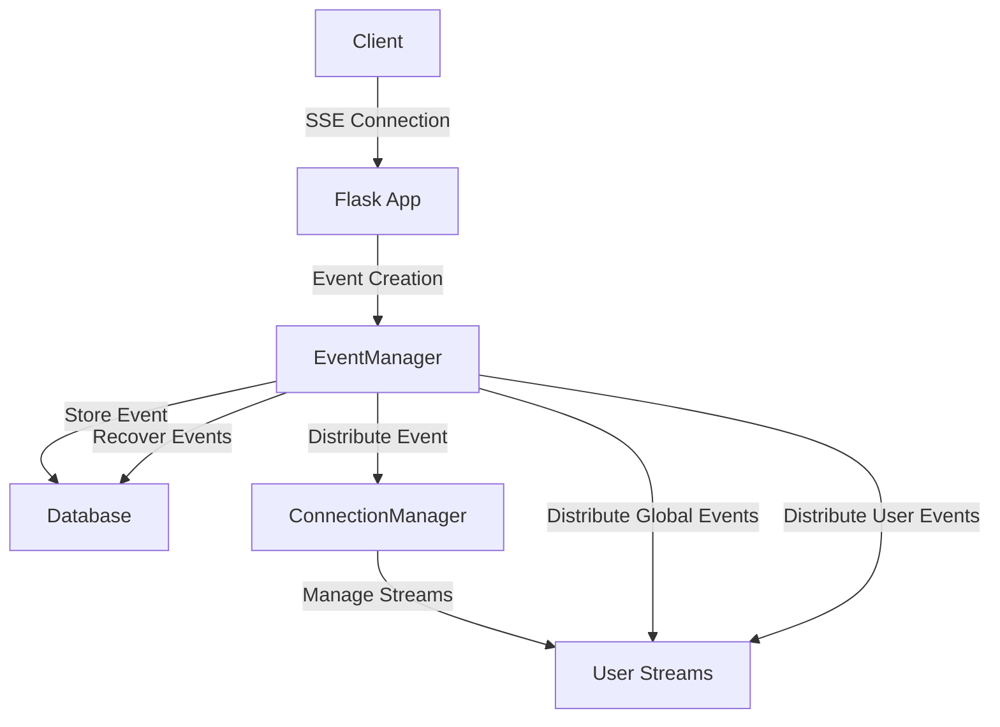

```mermaid
graph TD
    A[Client] -->|SSE Connection| B[Flask App]
    B -->|Event Creation| C[EventManager]
    C -->|Store Event| D[Database]
    C -->|Distribute Event| E[ConnectionManager]
    E -->|Manage Streams| F[User Streams]
    C -->|Recover Events| D
    C -->|Distribute Global Events| F
    C -->|Distribute User Events| F
```