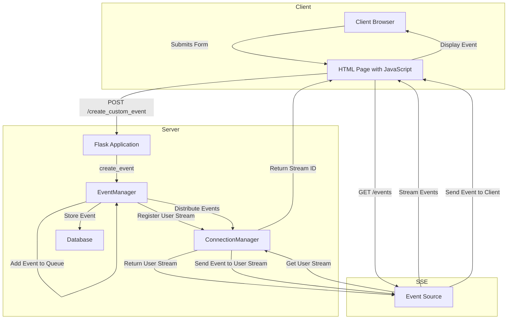

```mermaid
graph TD
    subgraph Client
        A[Client Browser]
        B[HTML Page with JavaScript]
    end

    subgraph Server
        C[Flask Application]
        D[EventManager]
        E[ConnectionManager]
        F[Database]
    end

    subgraph SSE
        G[Event Source]
    end

    A -->|Submits Form| B
    B -->|POST /create_custom_event| C
    C -->|create_event| D
    D -->|Store Event| F
    D -->|Add Event to Queue| D
    D -->|Register User Stream| E
    E -->|Return Stream ID| B
    B -->|GET /events| G
    G -->|Get User Stream| E
    E -->|Return User Stream| G
    G -->|Stream Events| B
    D -->|Distribute Events| E
    E -->|Send Event to User Stream| G
    G -->|Send Event to Client| B
    B -->|Display Event| A
```