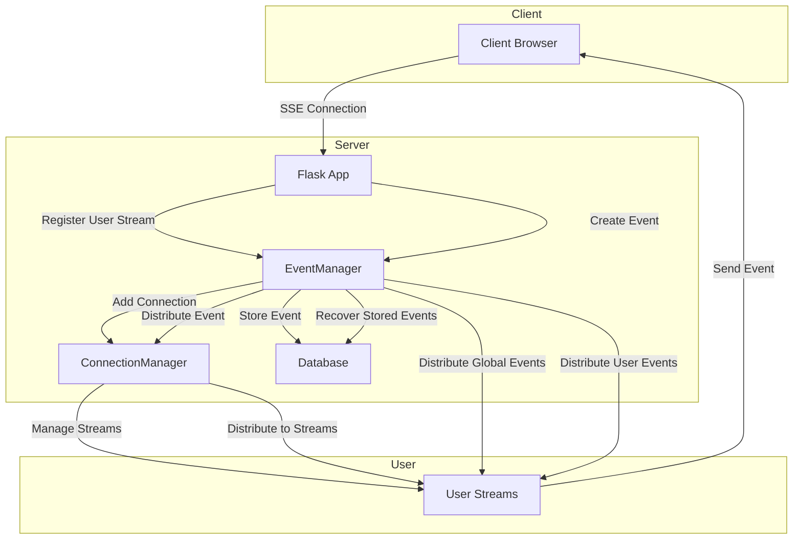

```mermaid
graph TD
    subgraph Client
        A[Client Browser]
    end

    subgraph Server
        B[Flask App]
        C[EventManager]
        D[ConnectionManager]
        E[Database]
    end

    subgraph User
        F[User Streams]
    end

    A -->|SSE Connection| B
    B -->|Register User Stream| C
    C -->|Add Connection| D
    D -->|Manage Streams| F

    B -->|Create Event| C
    C -->|Store Event| E
    C -->|Distribute Event| D
    D -->|Distribute to Streams| F

    C -->|Recover Stored Events| E
    C -->|Distribute Global Events| F
    C -->|Distribute User Events| F

    F -->|Send Event| A
```